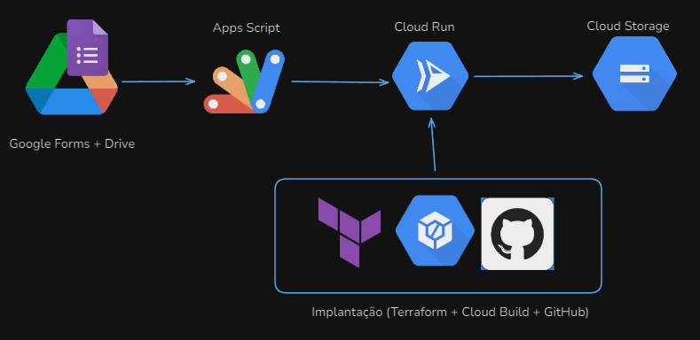
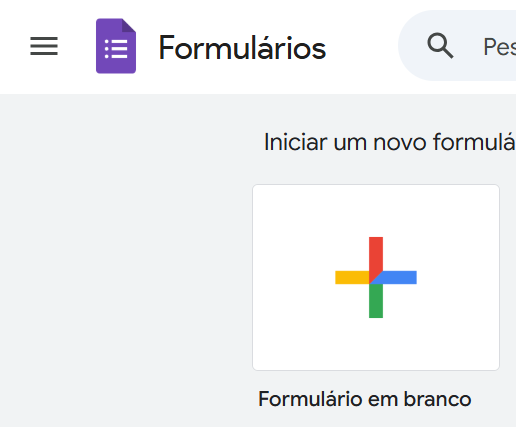
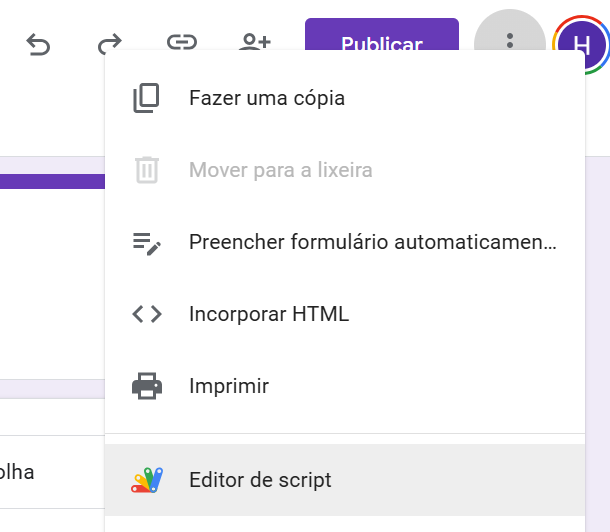
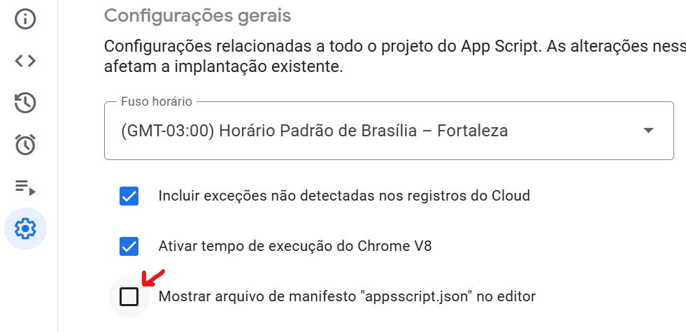
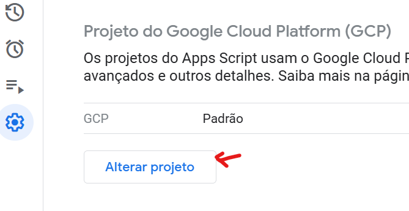
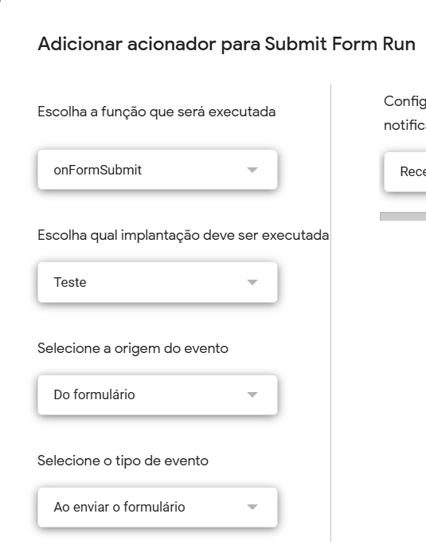

# Ingestão de Dados a partir de planilhas do Google Drive em ambiente Cloud (GCP) - Camada RAW

O objetivo deste projeto é desenvolver uma automação que colete dados estáticos e dinâmicos de um Google Drive (simulando um cenário muito comum de empresas de pequeno - médio porte) e armazene esses dados em uma camada raw, visando uma evolução para aspectos analíticos (será explorado nos futuros projetos). 

Imagine o cenário de um formulário de pesquisa de mercado que contém as seguintes perguntas:
- Estado em que vive (Campo de Seleção Única)
- Cidade em que vive (Campo de Texto)
- Cargo atual (Campo de Seleção única com opções: Desenvolvedor Web, Desenvolvedor Mobile, Cientista de Dados, Analista de Dados, Engenheiro de Dados, Devops, Outro)
- Por onde adquire novos conhecimentos? (Campo de seleção múltipla com opções: Livros, Cursos Online, Artigos (Medium, Dev.to), Formações Universitárias (Graduação, Mestrado, Doutorado, MBA), Vídeos no Youtube, Eventos)
- Quais ferramentas utiliza hoje? (Campo de Seleçao múltipla: Python, Java, Rust, C#, Elixir, R, SQL, Google Cloud, Amazon Web Services, Azure, Databricks, Apache Spark, Apache Nifi, Apache Airbyte, Apache Airflow, Apache Kafka)

Esse formulário ficará aberto durante um mês, tendo ciclos de abertura e fechamento ao longo do ano. Ou seja, não será algo pontual e único. O objetivo é quando uma resposta for feita no formulário um gatilho seja feito e ocorra a ingestão dos dados para um bucket no Cloud Storage.

Será utilizado Cloud Run como local de execução do código para a realização de ingestão de dados, que será desenvolvido em Python, seguindo os princípios da programação orientada a objetos (POO) e as melhores práticas de programação.

O gatilho de execução será configurado por meio do App Script, se integrando com o Google Forms + Google Sheets. O Cloud Run será provisionado via Terraform, combinado com Cloud Build e repositório do GitHub. Ou seja, toda vez que um commit for aplicado na branch main;master, deverá ser feito uma implantação, replicando a lógica.

## Tecnologias Utilizadas
- Python: Linguagem de programação utilizada para o desenvolvimento da pipeline.
- Cloud Run: O ambiente na nuvem que executará o código Python, fornecendo escalabilidade e flexibilidade.
- Cloud Storage: Um ambiente na nuvem que permitirá armazenar os arquivos JSON, incluindo as respostas da API de forma segura e escalável.
- App Scripts: O Apps Script é uma plataforma JavaScript baseada na nuvem com a tecnologia do Google Drive que permite a integração e automação de tarefas nos produtos do Google.
- Terraform: Uma ferramenta que possibilita a provisionamento eficiente de toda a infraestrutura necessária, seguindo a metodologia de infraestrutura como código (IaC).
- Cloud Build: O Cloud Build executa sua compilação como uma série de etapas de compilação, em que cada etapa de compilação é executada em um contêiner Docker. A execução das etapas de construção é análoga à execução de comandos em um script.

## Arquitetura


## Visão Geral do Fluxo

1. **Google App Script**: Captura automaticamente cada nova resposta do formulário.
2. **Script Python**: Recebe os dados do App Script, processa as informações e salva no Cloud Storage.
3. **Container Docker**: O script Python é empacotado em um container e implementado no Cloud Run.
4. **Terraform e Cloud Build**: Automatizam o provisionamento da infraestrutura e integração contínua com o repositório GitHub.
5. **Integração Final**: O App Script chama o Cloud Run para enviar as respostas capturadas.

---

## Requisitos

- Conta no Google Cloud Platform (GCP)
- Docker e Docker Compose instalados
- Terraform instalado
- Python (versão >= 3.8)
- Conta GitHub com repositório configurado

---

## Configuração do Projeto

### 1. Configuração do App Script
> [!IMPORTANT]  
> - Crie primeiro o App Script antes de implementar o Cloud Run
> - Certifique-se de que o Apps Script esteja no mesmo projeto GCP que o serviço Cloud Run 
> - Habilite a tela de consentimento do OAuth em APIs e serviços no seu projeto do GCP [Aqui](https://support.google.com/cloud/answer/6158849?hl=en#)

1. Google Formulários e Apps Script:
    - Crie um novo formulario em branco.

    
    
    - Acione o editor de script.

    

    - Em configuracoes selecione `Mostrar arquivo de manifesto "appsscript.json" no editor`

    

    - Ainda na aba de configurações click em `Alterar projeto` e informe o numero do projeto no GCP

    

    - Abra o arquivo "appsscript.json" e adicione o escopo necessário para poder integrar posteriormente com o cloud run

    ```javascript
    {
        "timeZone": "America/Fortaleza",
        "dependencies": {
        },
        "exceptionLogging": "STACKDRIVER",
        "runtimeVersion": "V8",
        "oauthScopes": [
            "https://www.googleapis.com/auth/script.container.ui",
            "https://www.googleapis.com/auth/cloud-platform",
            "https://www.googleapis.com/auth/script.external_request",
            "openid"
        ]
    }
    ```

    - Crie no editor o arquivo "btn_submit.gs", esse arquivo sera responsavel por enviar as respostas para o Clour Run
    
    ```javascript
    function sendCloudRun(responses) {
        const URI_CLOUD_RUN = "<URL_CLOUD_RUN>";
        const token = ScriptApp.getIdentityToken();

        const payload = {
            responses: responses
        };

        const options = {
            method: "post",
            contentType: "application/json",
            headers: {"Authorization":"Bearer "+token},
            payload: JSON.stringify(payload, null, 2)
        };
    
        const responsesApi = UrlFetchApp.fetch(URI_CLOUD_RUN, options);
        Logger.log(responsesApi.getContentText());
    }

    function onFormSubmit(e) {    
        const formResponse = e.response;

        const responses = formResponse.getItemResponses().map((itemResponse) => {
            return {
                question: itemResponse.getItem().getTitle(),
                response: itemResponse.getResponse()
            }
          }
        );

        sendCloudRun(responses);
    }
    ```

    - Agora vá em "Acionadores" e crie um gatilho para que ao clicar no botão `enviar` do formulário, seja acionado a função `onFormSubmit`

        


### 2. Desenvolvimento do Script Python
>[!IMPORTANT]
> Instale as bibliotecas python `pip install fastapi` e `pip install google-cloud-storage`

1. Crie um script Python que:
    - Receba dados enviados pelo App Script via requisição HTTP.
    - Valide e processe os dados.
    - Armazene as informações no Cloud Storage.

2. Estrutura do script Python:

```python
from fastapi import (
    FastAPI,
    Request,
    status
)
from google.cloud import storage
import json
from datetime import datetime
import os

app = FastAPI()

bucket_name = os.getenv('BUCKET_NAME')

@app.post("/", status_code=status.HTTP_200_OK)
async def receive_data(requests: Request):
    data = await requests.json()
    responses = data['responses']

    send_cloud_storage(responses)
    return {"status": "Data entered successfully"}


def send_cloud_storage(responses):
    file_to = f'data/response_{datetime.now():%Y%m%d_%H%M}'

    client = storage.Client()
    bucket = client.bucket(bucket_name)
    blob = bucket.blob(file_to)

    blob.upload_from_string(
        data=json.dumps(responses, indent=4, ensure_ascii=False),
        content_type='application/json'
    )
```

### 3. Container Docker

1. Crie um `Dockerfile` para empacotar o script Python:

```dockerfile
FROM python:3.12-slim

WORKDIR /ingestion_google_drive

COPY ingestion_google_drive/* /ingestion_google_drive/

RUN pip install --no-cache-dir --upgrade -r /ingestion_google_drive/requirements.txt

EXPOSE 8080

CMD ["fastapi", "run", "/ingestion_google_drive/main.py", "--port", "8080"]
```

### 4. Configuração do Cloud Run com Cloud Build, Github e terraform

A integração entre o GitHub e o Cloud Build permite que alterações feitas no repositório sejam automaticamente refletidas nos processos de build e deploy da infraestrutura, proporcionando maior eficiência e reduzindo erros manuais.

1. Conectar o repositório do GitHub ao Cloud Build.

    Siga as etapas detalhadas na documentação oficial do Google Cloud para conectar seu repositório GitHub ao Cloud Build:  
    [Configurar GitHub com o Cloud Build (1ª geração)](https://cloud.google.com/build/docs/automating-builds/github/connect-repo-github?hl=pt-br&generation=1st-gen)

2. Escreva os arquivos de configuração do Terraform para provisionar os recursos necessários:

    - Cloud Storage
    - Configurações do IAM
    - Configuração do gatilho do GitHub

3. Execute os comandos:

    ```bash
    terraform init
    terraform apply
    ```

---

## Estrutura do Repositório

```plaintext
ingestion_google_drive/
├── __init__.py
├── main.py
└── requirements.txt
terraform/
├── provider.tf
├── run-services.tf
├── service-account.tf
├── storage-bucket.tf
└── variables.tf
Dockerfile
```

---

## Conclusão

Este projeto foi desenvolvido com o objetivo de criar uma automação eficiente e escalável para a coleta de dados de um Google Drive, simulando cenários comuns em empresas de pequeno e médio porte. A implementação utiliza tecnologias modernas, como Cloud Run, Terraform e Cloud Build, para garantir automação, confiabilidade e facilidade de gerenciamento.  

Além disso, ao integrar o Google Forms e Sheets por meio do App Script, conseguimos criar um fluxo contínuo que permite a ingestão de dados em tempo real para o armazenamento em uma camada raw, criando uma base sólida para análises futuras.

# Indicação de Conteúdos
Aqui indicamos conteúdos internos da Apoena Stack e externos que podem auxiliar na sua trilha de construção desse projeto.

## Conteúdos da Plataforma da Apoena Stack
- [Curso Agregando Valor com Baixo Custo](https://apoenastack.ensinio.com/g/agregando-valor-com-baixo-custo/classwork)
- [Curso Disponibilidade de Dados via API com Google Cloud](https://apoenastack.ensinio.com/g/disponibilidade-de-dados-via-api-com-google-cloud/classwork)

## Conteúdos Externos
- [How to call Google Cloud Run (or Cloud Functions) from Apps Scripts](https://medium.com/geekculture/how-to-call-google-cloud-run-or-cloud-functions-from-apps-scripts-c0086289c965)
- [Tutorial: Como Criar um Gatilho no Google Apps Script](https://support.google.com/docs/community-guide/258700586/tutorial-como-criar-um-gatilho-no-google-apps-script?hl=pt-BR)

## Documentações
- [Como implantar no Cloud Run usando o Cloud Build](https://cloud.google.com/build/docs/deploying-builds/deploy-cloud-run?hl=pt-br)